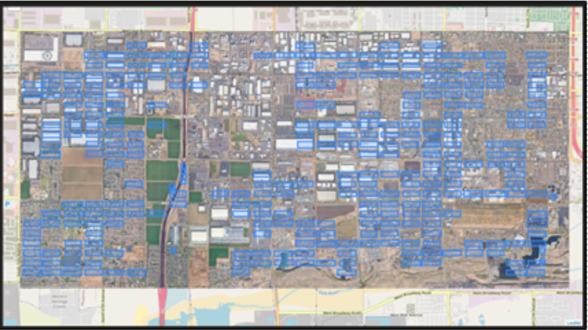
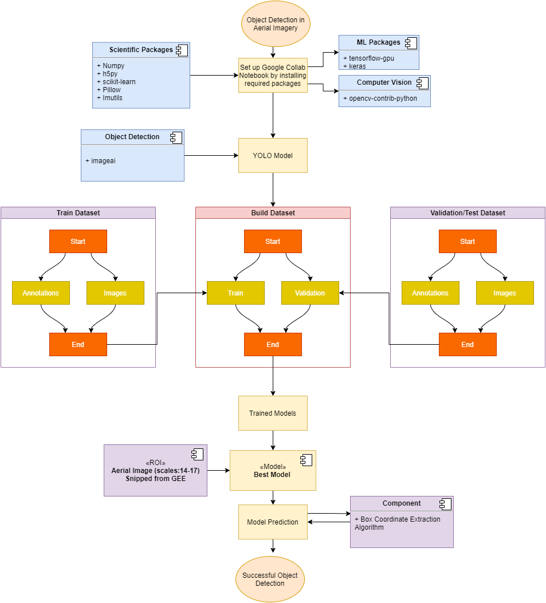
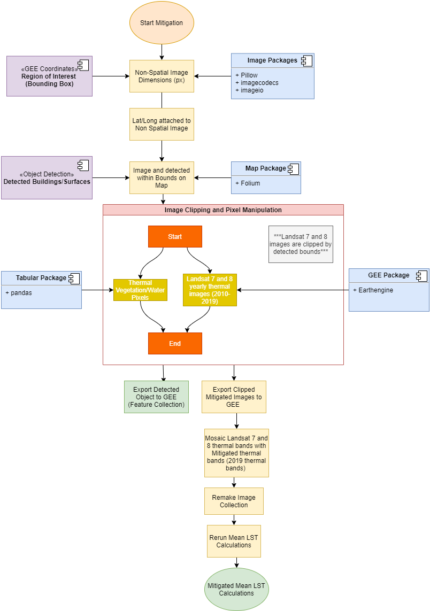

# Heat-Island-Mitigator
This project leveraged the use of Google Collab and ImageAI to create an Aerial Imagery Building Detection workflow. This workflow was used a somewhat supervised process to use the Pixel (x,y) coordinates of detected buildings bounds and transform these bounds to Latitude and Longitude. The transformed bounds were used to clip segments of Thermal Landsat (7 and 8) satellite imagery. The pixel values would be altered with values of sample locations to mitigate the image collection.

## Main Tools
* Google Collab
* ImageAI (Python package)
* Google Earth Engine Python and JavaScript APIs

### Links
* [Link To Notebook for the Building Detection Workflow (Go this for Object Detection)](https://colab.research.google.com/drive/18UE6pebRQzvEpaYFL_kv2mRu_u1ZLlQb?usp=sharing)
* [Link to Google Earth Engine Code Editor Repository](https://code.earthengine.google.com/?accept_repo=users/gioharvey14/Geog471_space)
* [Clone the Google Earth Engine Repo](git clone https://earthengine.googlesource.com/users/gioharvey14/Geog471_space)

### Image Results

   
   
Detected Buildings in Pixel (x,y) coordinates
 
   
    
Detected Buildings in WGS84 (Latitude, Longitude) coordinates

   
    
Building Detection Workflow

   
    
Thermal Imagery Mitigation Worflow

